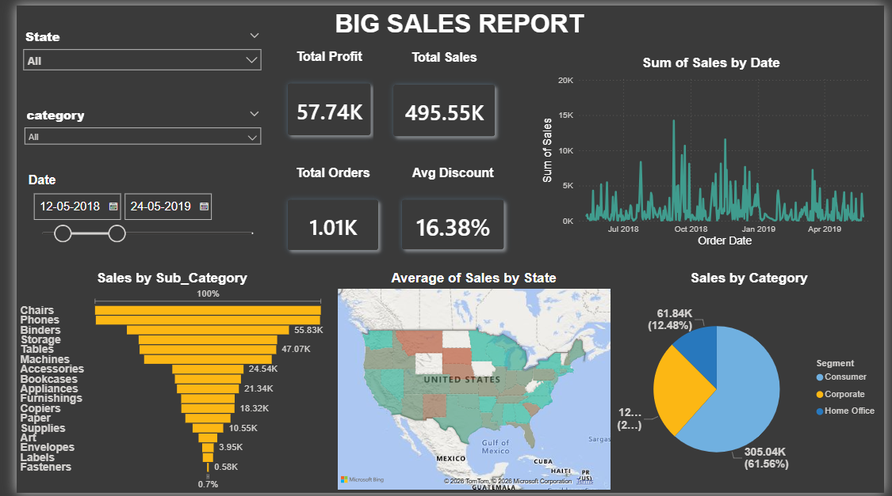

📊 Big Sales Report — Power BI Dashboard 
# 📊 Big Sales Report — Power BI Dashboard


Designed and developed an end-to-end sales analytics dashboard in Power BI using a cleaned transactional dataset. The report tracks $495.55K in total revenue, $57.74K profit, 1,010 orders, and a 16.38% average discount rate across a 12-month period (2018–2019).

---

## 📌 Project Overview

Built interactive visuals including a time-series trend chart, US state-level geographic heatmap, ranked sub-category bar chart, and customer segment pie chart. Implemented dynamic DAX measures and Power Query transformations to enable real-time filtering by state, category, and date range.

| Total Profit | Total Sales | Total Orders | Avg Discount |
|:---:|:---:|:---:|:---:|
| **57.74K** | **495.55K** | **1.01K** | **16.38%** |

---

## 🔑 Key Features

- 📈 **Sales trend line chart** — Sum of sales by order date (Jul 2018 – May 2019)
- 🗺️ **Geographic heatmap** — Average sales by US state using Bing Maps
- 📊 **Sub-category bar chart** — Ranked from Chairs (top) to Fasteners (bottom)
- 🥧 **Sales by segment pie chart** — Consumer, Corporate, Home Office breakdown
- 🔢 **KPI cards** — Total profit, total sales, order count, and average discount
- 🔍 **Interactive slicers** — Filter by State, Category, and custom date range

---

## 🛠️ Tools Used

| Tool | Purpose |
|------|---------|
| Microsoft Power BI Desktop | Data visualization & dashboard design |
| Excel / CSV Dataset | Source of sales data |
| Power Query | Data cleaning & transformation |
| DAX Measures | Custom KPI calculations |
| Bing Maps Visual | Geographic sales distribution |

---

## 🚀 How to Use

1. Clone this repository
```bash
   git clone https://github.com/zakvanzakvan86-dev/Big-Sales-Report-PowerBI.git
```
2. Open `BigSalesReport.pbix` in Power BI Desktop
3. If prompted, update the data source path to `/data/sales_data.csv`
4. Use the **State**, **Category**, and **Date** slicers to explore the data

---

## 📢 Key Insights

- **Chairs** dominate sub-category sales, followed by Phones (55.83K) and Binders (47.07K)
- **Consumer segment** accounts for 61.56% of total sales — the largest customer group
- **Peak sales** observed around Oct 2018 and Jan–Feb 2019
- **Low-volume items** like Fasteners (0.58K) may be candidates for portfolio review

---

## 🙌 Acknowledgments

Built as part of a Power BI learning journey focused on retail and sales analytics. Dataset sourced from publicly available sample sales data.
